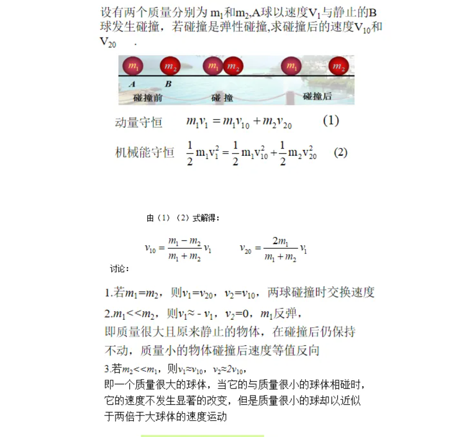
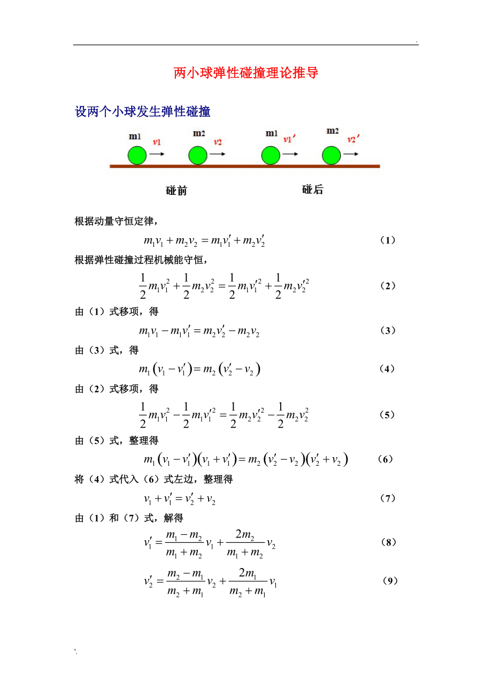
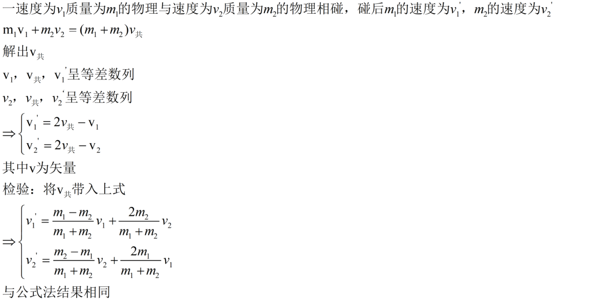

# 速度增量法解决弹性碰撞问题

弹性碰撞（elastic collision），又称完全弹性碰撞，指在理想情况下，物体碰撞后，形变能够恢复，不发热、发声，没有动能损失；完全弹性碰撞是恢复系数为1的碰撞。请注意后一种表述与前一种完全等价，但采用后一种更容易对问题做定量分析。 [1]真正的弹性碰撞只在分子、原子以及更小的微粒之间才会出现。生活中，硬质木球或钢球发生碰撞时，动能的损失很小，可以忽略不计，通常也可以将它们的碰撞看成弹性碰撞。
## 定义法

动量守恒&#43;动能守恒&lt;br /&gt;

#### 动碰静

#### 动碰动

## 速度增量法
设碰前m1，m2的速度为v1,v2。碰后m1,m2的速度为v1&#39;,v2&#39; &lt;br /&gt;

---

> 作者: [Haoran Dong](https://github.com/TEWQ-1314)  
> URL: https://www.depth.su/posts/2024718/  

